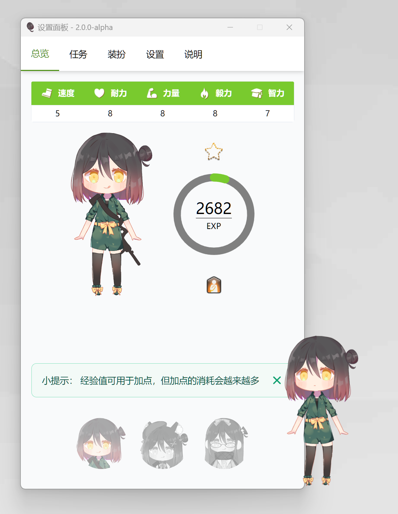

# JPet


## 桌面宠物轴伊

更新发布网站: [https://pet.vjoi.cn](https://pet.vjoi.cn)



## Live2d 模型

模型绘制：轴伊 Joi

\*该 Live2d 模型不可用于其他用途

## 编译

> 仅支持 Windows 平台（Win10 及以上）

该项目需要的部分依赖已经置于`thirdparty`下，包括：

- GLFW
- FMOD CORE
- CubismSdkForNative

其余依赖定义在 vcpkg.json 中。

执行以下命令进行构建并运行：

```powershell
git submodule update --init
.\build-scripts\build_and_run.ps1
```

详细的构建过程可见 `build_and_run.ps1` 的内容，主要分为三步：

1. 前端构建（GamePanel 使用 Webview2 加载页面作为窗口内容）
2. CMake 配置
3. 构建以及运行

## 游戏设计

- [数值设计文档](doc/attributes.md)

## Live2D Open Software License

Live2D Cubism Components is available under Live2D Open Software License.

- [Live2D Open Software License Agreement](https://www.live2d.com/eula/live2d-open-software-license-agreement_en.html)
- [Live2D Open Software 使用許諾契約書](https://www.live2d.com/eula/live2d-open-software-license-agreement_jp.html)

## Live2D Proprietary Software License

Live2D Cubism Core is available under Live2D Proprietary Software License.

- [Live2D Proprietary Software License Agreement](https://www.live2d.com/eula/live2d-proprietary-software-license-agreement_en.html)
- [Live2D Proprietary Software 使用許諾契約書](https://www.live2d.com/eula/live2d-proprietary-software-license-agreement_jp.html)
