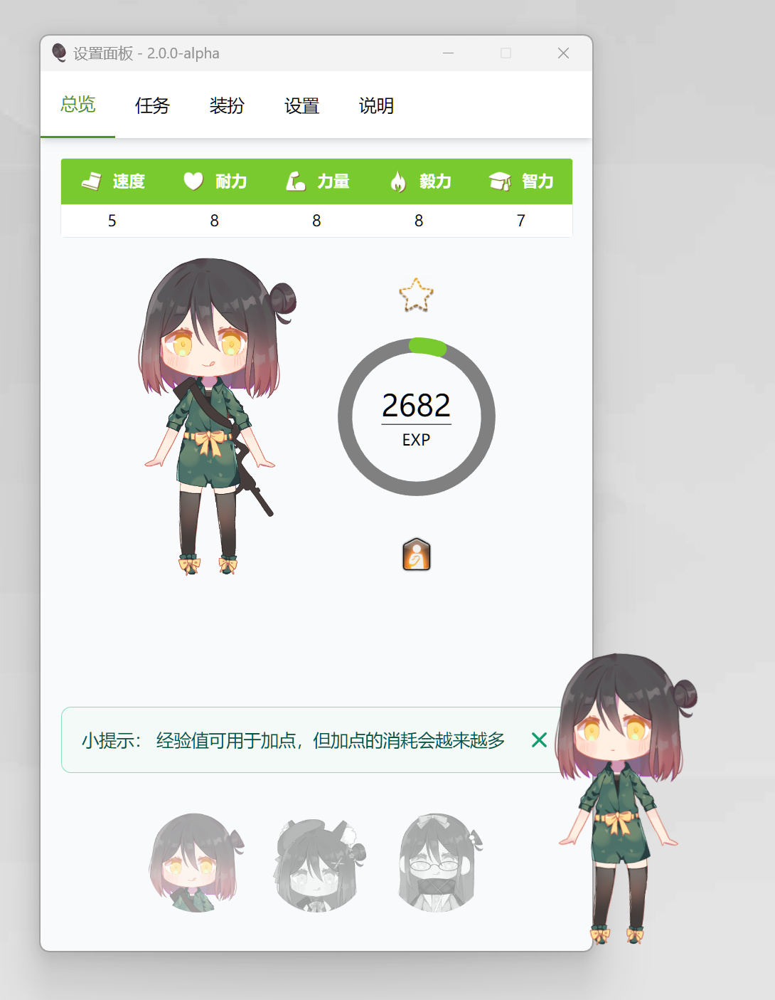

# JPet

## 自动构建与更新

推送版本 tag（如 `3.0.0` 或 `v3.0.0`）会触发
[发布工作流](.github/workflows/release-build.yml)，构建 Windows x64 和 macOS ARM64。
两个平台都通过构建与更新测试后，工作流自动创建 GitHub Release，上传：

- `jpet-<版本>-windows-x64.zip`：完整便携包，也是 Windows 自动更新包。
- `jpet-<版本>-windows-x64-setup.exe`：当前用户安装程序。
- `jpet-<版本>-macos-arm64.zip`：包含 `JPet.app` 的完整应用包。
- `SHA256SUMS`：下载文件的 SHA-256 校验值。

```sh
git tag 3.0.0
git push origin 3.0.0
```

也可以在 Actions 中手动运行工作流，输入 `3.0.0` 进行构建测试；手动运行只上传
Actions artifacts。`3.0.0-rc.1` 等预发布 tag 会创建 prerelease，程序仅自动检查正式 Release。

启动时会在后台检查 [GitHub Releases](https://github.com/Xinrea/JPet/releases)，之后每 6 小时
自动检查一次。设置面板的「说明」页面支持手动检查、查看更新说明、下载和「重启并更新」。
更新包会通过 HTTPS 下载，并验证 GitHub Release asset 的 SHA-256 和文件大小。
下载、校验及解压完成后，点击重启才会安装；安装助手等待旧进程正常退出，替换应用后
重新启动。替换或启动失败会尝试恢复旧版本，本地用户数据保留在原数据目录中。

macOS 应先将 `JPet.app` 移到可写的应用目录再运行。发布包使用 ad-hoc 签名，未进行
Apple Developer ID 签名和公证。Windows 旧版若安装在 Program Files，更新时会请求 UAC 授权。
失败信息会保存在用户数据目录的 `updates/last-error.txt`，Mac 助手详细日志位于相应下载目录。

更新校验与 Mac 安装助手回归检查：

```sh
cmake -S . -B build/macos-arm64 -DJPET_BUILD_UPDATE_TESTS=ON
cmake --build build/macos-arm64
ctest --test-dir build/macos-arm64 --output-on-failure
python3 tests/update_helper_test.py
```

## macOS（Apple Silicon）

项目现在支持使用 Apple Silicon（`arm64`）的 macOS。macOS 版本使用 GLFW/Cocoa
透明窗口、WKWebView 设置和登录窗口、AVFoundation 音频以及菜单栏状态项；透明区域
暂时仍属于 JPet 窗口并会接收鼠标事件。

依赖准备和构建：

```sh
cd resources/panel
npm ci --legacy-peer-deps
npm run build
cd ../..

./build/vcpkg/bootstrap-vcpkg.sh -disableMetrics
./build/vcpkg/vcpkg install --triplet arm64-osx

cmake -S . -B build/macos-arm64 -G Ninja \
  -DCMAKE_BUILD_TYPE=Release \
  -DCMAKE_OSX_ARCHITECTURES=arm64 \
  -DCMAKE_TOOLCHAIN_FILE=build/vcpkg/scripts/buildsystems/vcpkg.cmake \
  -DVCPKG_TARGET_TRIPLET=arm64-osx
cmake --build build/macos-arm64
open build/macos-arm64/bin/JPet/JPet.app
```

也可以使用一键脚本完成前端构建、CMake 配置、C++ 依赖安装、编译和启动：

```sh
./build-scripts/build_and_run_macos.sh
```

如果是第一次在本机设置开发环境，可以先运行准备脚本。它会自动检查工具、
下载并初始化 vcpkg、安装前端依赖和 C++ 依赖：

```sh
./.agents/prepare
./build-scripts/build_and_run_macos.sh
```

`.agents/linked` 会将 `build/vcpkg` 链接到本机的共享目录，因此多个 Delta
工作区不会重复保存 vcpkg。首次使用时如果共享目录还没有 vcpkg，准备脚本会自动
下载并初始化；之后的工作区会复用同一份 checkout。脚本默认使用
`build/vcpkg` 和 `build/vcpkg_installed`。如果 vcpkg 位于其他位置，可以通过环境变量覆盖：

```sh
VCPKG_DIR=/path/to/vcpkg \
VCPKG_INSTALLED_DIR=/path/to/vcpkg_installed \
./build-scripts/build_and_run_macos.sh
```

默认构建 Release 版本；开发调试时可以使用：

```sh
BUILD_TYPE=Debug ./build-scripts/build_and_run_macos.sh
```

游戏规则和存档已迁移到 Cloudflare。构建时从 `cloud/wrangler.jsonc` 读取生产域名，
Windows 和 macOS 发布版默认连接 `https://s.jpet.powerlive.io`，登录账号后自动同步。
未连接时显示缓存，任务与挂机经验保持暂停。服务开发、部署和协议见
[云端游戏服务说明](doc/cloud-game.md)。

云端任务与存储回归检查：

```sh
cd cloud
npm ci
npm run types
npm test
cd ..
python3 tests/cloud_config_test.py
bash build-scripts/test_cloud_sync_macos.sh
```

Apple 已弃用 OpenGL，但当前 Live2D OpenGL 渲染路径仍可运行；后续如需长期支持，
应另行评估 Cubism Metal 渲染后端。macOS 的登录页会使用系统持久化的 WebKit
Cookie 存储。


## 桌面宠物轴伊

更新发布网站: [https://pet.vjoi.cn](https://pet.vjoi.cn)



## Live2d 模型

模型绘制：轴伊 Joi

\*该 Live2d 模型不可用于其他用途

## 编译

> Windows 构建需要 Win10 及以上；Mac ARM 构建方式见上文。

该项目需要的部分依赖已经置于`thirdparty`下，包括：

- GLFW
- FMOD CORE
- CubismSdkForNative

其余依赖定义在 vcpkg.json 中。

执行以下命令进行构建并运行：

```powershell
git submodule update --init
.\build-scripts\build_and_run.ps1
```

详细的构建过程可见 `build_and_run.ps1` 的内容，主要分为三步：

1. 前端构建（GamePanel 使用 Webview2 加载页面作为窗口内容）
2. CMake 配置
3. 构建以及运行

## 游戏设计

- [数值设计文档](doc/attributes.md)
- [成就系统：50 个成就与解锁条件](doc/achievements.md)
- [Cloudflare 云端游戏服务与部署](doc/cloud-game.md)

面板新增「成就」页面，展示收集比例、分类、解锁条件、单项进度和解锁日期，
支持搜索、状态筛选和排序。成就会自动解锁并提示；升星或消耗属性不会撤销成就。
旧存档按现存记录补发可确认的成就，陪伴时长和互动次数从更新后开始累计。

成就条件与持久化检查（使用独立临时存档）：

```sh
bash build-scripts/test_achievements_macos.sh
bash build-scripts/test_task_queue_macos.sh
```

## Live2D Open Software License

Live2D Cubism Components is available under Live2D Open Software License.

- [Live2D Open Software License Agreement](https://www.live2d.com/eula/live2d-open-software-license-agreement_en.html)
- [Live2D Open Software 使用許諾契約書](https://www.live2d.com/eula/live2d-open-software-license-agreement_jp.html)

## Live2D Proprietary Software License

Live2D Cubism Core is available under Live2D Proprietary Software License.

- [Live2D Proprietary Software License Agreement](https://www.live2d.com/eula/live2d-proprietary-software-license-agreement_en.html)
- [Live2D Proprietary Software 使用許諾契約書](https://www.live2d.com/eula/live2d-proprietary-software-license-agreement_jp.html)
