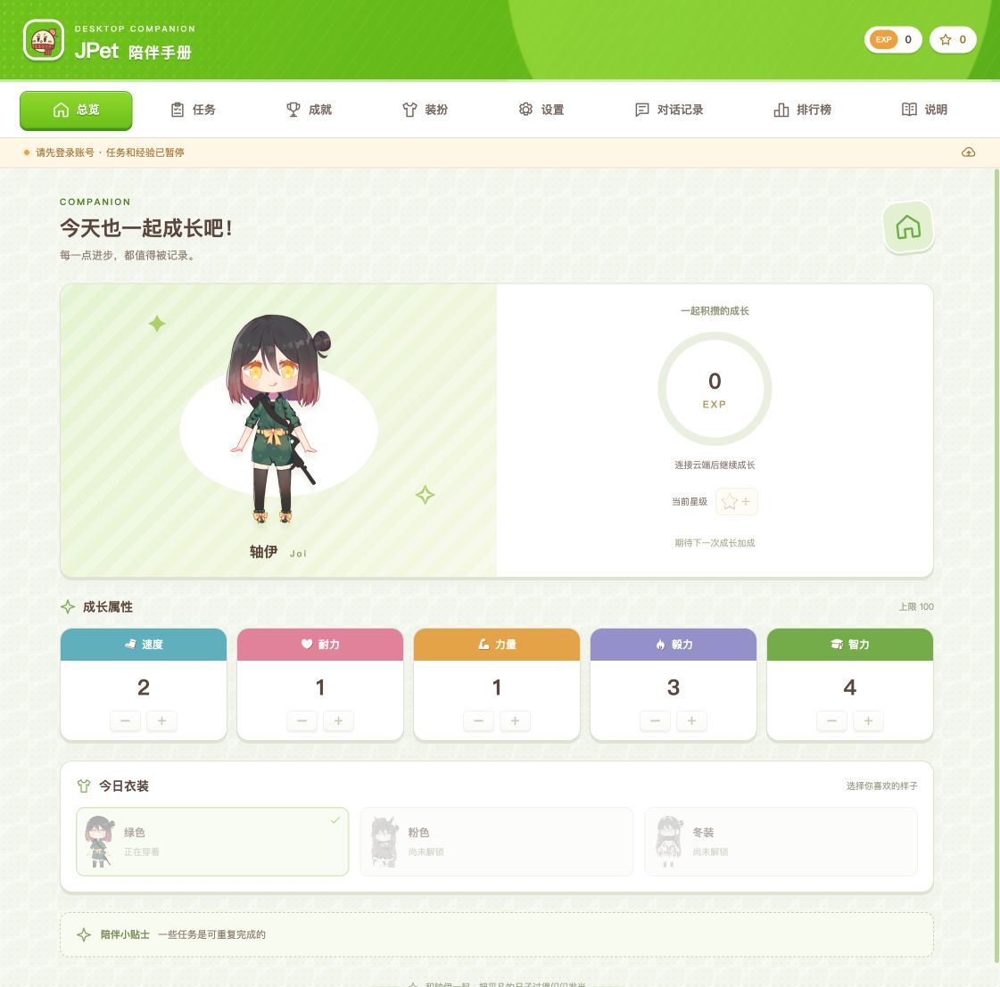

# JPet · 桌面宠物轴伊


让轴伊 Joi 陪你度过桌面上的每一天。JPet 是一款基于 Live2D 的桌面宠物，支持桌面互动、养成任务、衣装搭配和千问实时语音对话，运行于 Windows x64 和 macOS Apple Silicon。

[下载发行版](https://github.com/Xinrea/JPet/releases) · [项目网站](https://pet.vjoi.cn) · [语音使用指南](doc/voice-chat.md) · [开发与发布说明](doc/development.md)

## 功能

- **桌面陪伴**：Live2D 角色、点击互动、声音反馈和显示设置。
- **成长养成**：积攒经验，提升速度、耐力、力量、毅力和智力，升星获得成长加成。
- **任务与成就**：安排任务队列，使用星星扩容；收集 50 个成就，查看进度、解锁条件和日期。
- **衣装搭配**：解锁衣装，调整发型、头饰、表情和配件，保存角色 PNG 截图。
- **实时语音**：按快捷键开关麦克风，与轴伊连续聊天，通过语音查询成长、安排任务、调整日常设置与装扮、搜索网页和查看桌面；在面板中回看对话记录。
- **云端存档**：登录 B 站账号后同步成长与任务，可选择参与排行榜。

## 界面预览

当前面板包含总览、任务、成就、装扮、设置、对话、排行榜和说明八个页面。



| 成就收藏 | 装扮设置 |
| --- | --- |
|  |  |

## 下载与使用

从 [GitHub Releases](https://github.com/Xinrea/JPet/releases) 选择对应平台的文件：

| 平台 | 下载文件 | 使用方式 |
| --- | --- | --- |
| Windows 10 及以上 · x64 | `jpet-<版本>-windows-x64-setup.exe` | 运行安装程序，安装到当前用户目录 |
| Windows 10 及以上 · x64 | `jpet-<版本>-windows-x64.zip` | 完整解压便携包后运行 `JPet.exe` |
| macOS 11 及以上 · Apple Silicon | `jpet-<版本>-macos-arm64.zip` | 解压，将 `JPet.app` 移到可写的应用目录后运行 |

macOS 发布包采用 ad-hoc 签名，未进行 Apple Developer ID 签名和公证。
当前 macOS 版本的透明区域仍会接收鼠标事件。

### 开始陪伴

1. 启动 JPet，从 Windows 托盘或 macOS 菜单栏的 JPet 菜单打开「设置」。
2. 在面板「设置」中登录 B 站账号，等待状态栏显示云端已连接。
3. 在「总览」查看成长，在「任务」安排训练，在「装扮」调整喜欢的造型。

成长与任务按有效在线时间推进。未登录、断网或退出时暂停，重新连接后继续，离线时间不补算。
同一账号同时只能由一个会话推进游戏，切换设备时可在设置中接管会话。详见[云端游戏说明](doc/cloud-game.md)。

### 语音对话

在「对话 → 语音对话设置」选择 AI 服务：使用自己的北京地域百炼 API Key / 业务空间，或登录 PowerLive 账号使用 JPet Server。
JPet Server 每个账号每日提供 2,000,000 token，语音、桌面识别和网页搜索共用，按北京时间零点重置。
Mac 按 **Option**、Windows 按 **Ctrl** 开启麦克风，再按一次关闭；开启后可连续多轮对话，说话可打断回复。也可以在语音设置中改为按住说话、松开回复。
首次使用需允许麦克风权限，查看桌面还需要录屏权限。

API Key 保存在 macOS 钥匙串或 Windows 凭据管理器，不上传到 JPet 云端。
最近 200 轮对话文字保存在本机。配置、语音工具和数据处理细节见[语音对话说明](doc/voice-chat.md)。

### 应用更新

启动时检查正式发行版，之后每 6 小时检查一次，也可在「说明」页面手动检查。
下载完成并通过 SHA-256 与文件大小校验后，点击「重启并更新」安装；本地用户数据会保留。
预发布版本不会被自动更新选中。

## 开发构建

客户端使用 C++17、CMake 和 Live2D Cubism，面板使用 Svelte + Vite，云端游戏服务使用 Cloudflare Workers。
前端构建产物会随应用一起打包，需先构建面板再配置 CMake。

先克隆仓库并初始化子模块：

```sh
git clone --recurse-submodules https://github.com/Xinrea/JPet.git
cd JPet
```

已有 checkout 可运行 `git submodule update --init --recursive`。

### macOS · Apple Silicon

准备 Xcode Command Line Tools、CMake 3.27+、Ninja 和 Node.js 22+，然后运行：

```sh
./.agents/prepare
./build-scripts/build_and_run_macos.sh
```

准备脚本会初始化 vcpkg 并安装前端与 C++ 依赖；构建脚本默认编译 Release 并启动应用。
调试构建使用 `BUILD_TYPE=Debug ./build-scripts/build_and_run_macos.sh`。

### Windows · x64

准备 Visual Studio 2022 的 C++ 桌面开发组件、Windows SDK、CMake 3.27+、Node.js 22+ 和 vcpkg。
在仓库根目录的 PowerShell 中执行，按本机位置修改 `$vcpkgDir`：

```powershell
Push-Location resources/panel
npm ci --legacy-peer-deps
npm run build
Pop-Location

$vcpkgDir = "D:/vcpkg"
cmake -S . -B build/windows-x64 -G "Visual Studio 17 2022" -A x64 `
  -DCMAKE_BUILD_TYPE=Release `
  "-DCMAKE_TOOLCHAIN_FILE=$vcpkgDir/scripts/buildsystems/vcpkg.cmake" `
  -DVCPKG_TARGET_TRIPLET=x64-windows
cmake --build build/windows-x64 --config Release --parallel
& ./build/windows-x64/bin/JPet/Release/JPet.exe
```

完整依赖说明、macOS 手动构建、回归检查和自动发布流程见[开发与发布说明](doc/development.md)。

## 相关文档

| 文档 | 内容 |
| --- | --- |
| [语音对话](doc/voice-chat.md) | 配置、快捷键、对话记录、语音工具与诊断 |
| [云端游戏服务](doc/cloud-game.md) | 在线规则、存档迁移、任务队列、协议与部署 |
| [成就系统](doc/achievements.md) | 50 个成就及解锁条件 |
| [数值设计草案](doc/attributes.md) | 属性与成长机制的设计参考；实际规则以程序为准 |
| [开发与发布](doc/development.md) | 本地构建、验证、发布包与更新排查 |

## 模型与许可

模型绘制：**轴伊 Joi**。本项目中的 Live2D 模型不可用于其他用途。

项目代码采用 [MIT License](LICENSE)；Live2D 组件与 Core 分别适用以下许可，模型和第三方组件不由项目 MIT 许可授权：

- Cubism Components：[Live2D Open Software License](https://www.live2d.com/eula/live2d-open-software-license-agreement_en.html)（[日文](https://www.live2d.com/eula/live2d-open-software-license-agreement_jp.html)）。
- Cubism Core：[Live2D Proprietary Software License](https://www.live2d.com/eula/live2d-proprietary-software-license-agreement_en.html)（[日文](https://www.live2d.com/eula/live2d-proprietary-software-license-agreement_jp.html)）。
