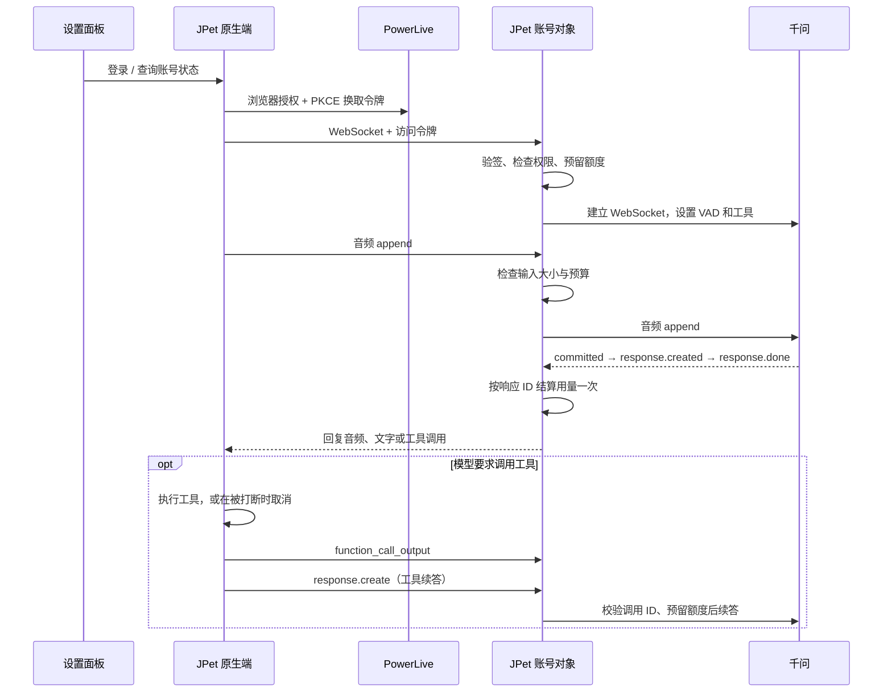

# AI 服务流程检查

## 两种入口

自定义服务由原生端读取本机千问配置并直连千问。JPet Server 则使用 PowerLive 账号，将访问令牌交给 JPet 云端，由云端读取千问 secrets 转发。设置面板只调用本机接口显示状态，不持有访问令牌、刷新令牌或千问密钥。

## 语音与打断

按一次 Option（Mac）或 Ctrl（Windows）开启麦克风，再按一次关闭；松开按键不改变录音状态。关闭麦克风时追加一秒静音。按键本身不会提交语音或取消模型回复。千问通过语义 VAD 判断开口、句尾和自动回复，避免一轮语音生成两次。

收到 `speech_started` 时，原生端停止旧播放、取消排队工具并丢弃迟到结果。云端同时撤销旧工具的续答资格，标记正在生成及等待 `response.created` 的回复为已打断。已签发工具的取消结果仍可提交一次；未知或重复的调用结果拒绝。

工具结果与新语音可能在两个方向交叉传输。因此旧 `response.create` 在打断后到达时直接忽略，由新语音的自动回复接管。待确认回复保留发起时的预算，后续输入不会改变旧回复的结算依据。音频提交和回复建立、结束按各自 ID 去重。

`cancelled`、`incomplete`、`failed` 属于某一条回复的结束状态。若缺少 `usage`，该回复按自身预算保守记账，连接继续使用；有有效用量则按实际值记账。正常完成却缺少有效用量、未知回复、无效工具结果及不支持的客户端消息仍会终止连接，避免未知费用或注入模型上下文。

## 额度与连接边界

| 项目 | 规则 |
| --- | --- |
| 每日账号额度 | 2,000,000 token，所有设备和云端模型共享 |
| 重置 | 北京时间每日 00:00；升级额度保留已用量和预留 |
| 同时连接 | 每账号一条语音连接 |
| 语音输出 | 单条最多 2,048 token |
| 工具模型输出 | 单次最多 1,500 token |
| 语音预算 | 上下文估算加 8,192 的单响应预算不得超过 32,768；这是上下文边界，不随每日额度倍增。每条回复结束后，用其实际 `input_tokens + output_tokens` 覆盖估算，再加上回复期间新增输入的估算 |
| 握手 | 15 秒，仅约束握手，升级成功立即清除计时器 |
| 会话 | 最长 10 分钟，同时受当前登录令牌有效期和北京零点约束 |
| 本机等待 | 无活动等待回复 45 秒；麦克风关闭且空闲两分钟结束连接 |
| 断线结算 | 未发出的预算退还；已发出且无法确认费用的预算保守扣除 |

网页搜索和桌面识别通过云端 HTTP 模型接口独立记账，B 站搜索使用本机已有 B 站登录。工具调用失败会返回工具错误，模型应据此说明失败；不得自动重试游戏操作。重新开始连接会建立新的语音上下文，但不会重置每日额度。

## 本次检查与验证

此前定向验证观察到：工具结果和 `response.create` 已转发，但回复在再次上传音频后才开始；用户再次按下快捷键但不说话也能触发回复。这只能说明事件时间相关，尚不能认定为唯一根因。已改为开关式持续采集，并在麦克风关闭后的工具续答追加有上限的纯静音帧。云端补帧最多一秒，收到客户端音频或 `response.created` 即停止；不会重新打开麦克风或重复执行工具。

持续开启时，不再按累计采集一分钟停止上传。云端仅对单段未结束的 VAD 语音限制 62 秒，静音等待仍检查费用与会话预算。

本机 2026-10-09 18:40–18:41 的日志显示，首轮正常，B 站搜索及第一次续答正常；第二次搜索续答等待约 28 秒，收到 `response.created` 后出现云端 `jpet_upstream_error`。这将排查范围缩到语音续答与新输入重叠阶段。该日志不含云端具体失败码，不能单凭它证明唯一原因。

代码检查发现并修正了：取消回复缺少用量会关闭连接；尚未收到 `response.created` 的续答未随新语音标记；旧续答与新轮次交叉时被当作协议错误；重复提交或回复建立可能增加待回复计数。还修正了使用说明中“云端另行触发 VAD 回复”的过时表述。

Workers 回归用例覆盖两轮自动回复、工具续答、打断时工具取消结果、延迟回复建立、取消/不完整/失败回复缺少用量、重复事件计费、超过握手时限的连接，以及已有账号额度升级后保留账本。模拟测试验证这些状态路径；实际模型对话仍需结合云端日志确认。

实时诊断日志仅包含静态失败码、阶段、耗时、待回复数、活跃回复数、待工具数、安全格式的上游错误码及估算费用，不记录音频、对话文本、截图或凭据。当前 Wrangler 登录可读取实时日志，但历史 Observability 查询返回权限错误，因此本次未读取到 18:41 失败的云端历史明细。

### 2026-10-09 后续实测

开关式麦克风上线后仍收到一次卡住反馈。随后用固定合成语音和虚构经验值验证了直连千问、已部署的账号转发服务、原生 Session 协议三条路径，均收到工具后的语音续答；云端连续三轮调用也完成，续答建立延迟约 0.7–1.0 秒。本机日志中 20:07:02 和 20:07:12 的真实工具调用均在下一秒建立续答，用户随后反馈测试似乎正常。本轮未改动或重新部署生产逻辑，尚未定位此前间歇性停顿的唯一触发条件。临时预览和实时日志会话已关闭。
